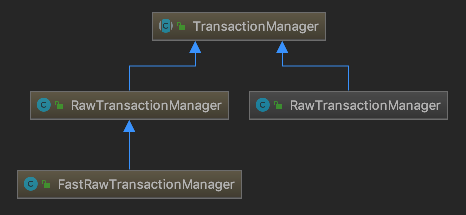

# Simple_tx_tracker

## Development Stack and Environment
- Spring-boot 2.1.7.RELEASE
- Web3j
- Parity 2.5.6-stable
- truffle.js (contract)
- ropsten (testnet) 
- ganache (local) 

## Transaction Status
- SUCCESS :
success to send  
- FAIL :
(the transaction which included in block) when there is not enough gas when run the contract or an exception occurs during execution  
- PENDING :
pending transaction in txpool  
- LOST :
tx entered txpool and exited with memory problem
- SENT_CANCEL :
send but canceled because same nonce (same as REPLACED)  
- SENT_UNKNOWN :
send and not SENT_CANCEL and don't exist in txpool (maybe network failure or can be seen in txpool a lot later)

## Structrue

<p align="center">
    	</img>
	
</p>


## Trouble Shooting
### eth_getTransactionReceipt
web3j는 tx가 block에 포함 되었는지를 receipt의 여부를 통해 확인한다. 이 과정은 결국 node(geth or parity)에 [eth_getTransactionReceipt](https://github.com/ethereum/wiki/wiki/JSON-RPC#eth_gettransactionreceipt) rpc를 요청해서 받아낸다. 

docs
> Returns the receipt of a transaction by transaction hash.
**Note That** the receipt is not available for pending transactions.

즉, pending transaction은 search하지 않는다.
go-ethereum의 eth_getTransactionReceipt 처리 로직을 보면 직접 확인할 수 있다.
```go
// GetReceiptsByHash retrieves the receipts for all transactions in a given block.
func(bc *BlockChain) GetReceiptsByHash(hash common.Hash) types.Receipts {
	if receipts, ok := bc.receiptsCache.Get(hash); ok {
		return receipts.(types.Receipts)
	}
	number := rawdb.ReadHeaderNumber(bc.db, hash)
	if number == nil {
		return nil
	}
	receipts := rawdb.ReadReceipts(bc.db, hash, *number)
	if receipts == nil {
		return nil
	}
	bc.receiptsCache.Add(hash, receipts)
	 return receipts
}
```

### Canceled Tx

tx가 replace되거나 cancel되는 상황을 확인 및 연출하기 위해서는 같은 nonce를 가진 transaction을 만들어야 한다.

하지만 이 기능과 web3j가 제공하는 transaction을 manage하는 기능(내부 queue를 활용해 receipt 여부를 확인 및 관리, [QueuingTransactionReceiptProcessor](https://github.com/web3j/web3j/blob/master/core/src/main/java/org/web3j/tx/response/QueuingTransactionReceiptProcessor.java))을 같이 사용하지 못하는 구조를 가지고 있다.

<p align="center">
    	</img>
</p>

`RawTransactionManage` 또는 `RawTransactionManage` 은 `TransactionManager`를 구현하고 있다.
그리고 `ManagedTransaction`을 구현하는 Transfer와 Contract는 내부적으로 `TransactionManager`를 DI받아서 Transaction을 send하고 receipt 존재 여부를 확인하는 기능을 가지고 있다.
여기서 nonce 값은 `TransactionManager`가 network에 직접 요청해서 최신 nonce를 가져오는 형태로 되어 있기 때문에 임의의 nonce를 발생 시키기 위해서는 web3j코드를 수정해야 할 필요가 있다.

<p align="center">
    	</img>
</p>

수정 내용은 임의의 nonce값을 받을 수 있게 `RawTransactionManager`를 수정, 그리고 이것을 `Transfer` 또는 `Contract`에 DI를 시키면 임의의 nonce 값을 가진 transaction을 만들고 요청할 수 있다.

